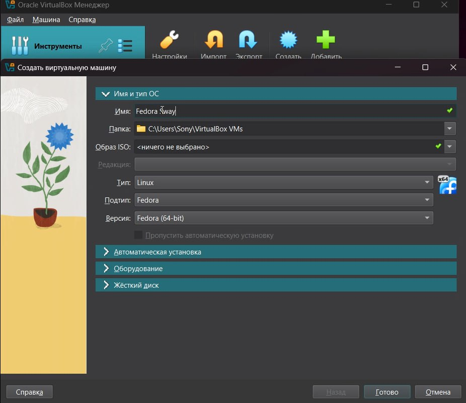
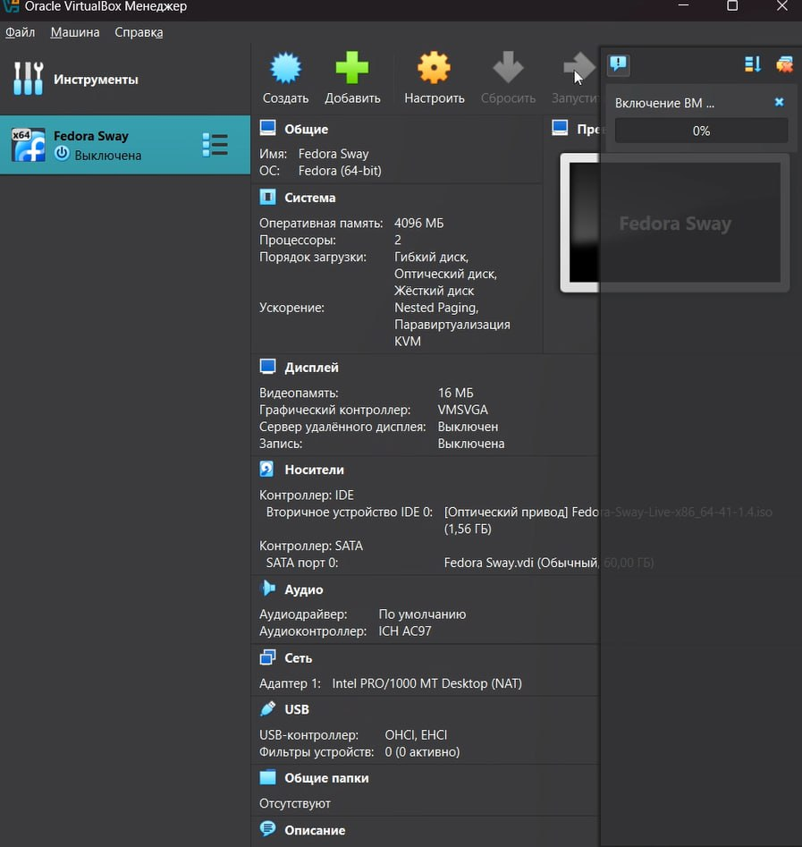
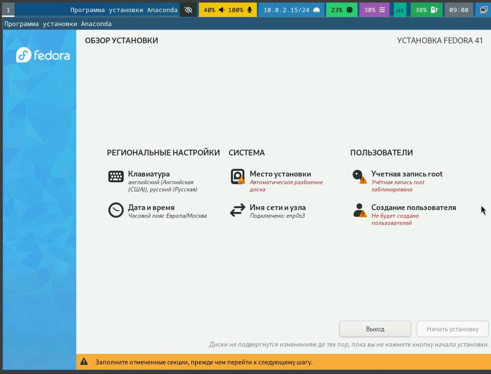
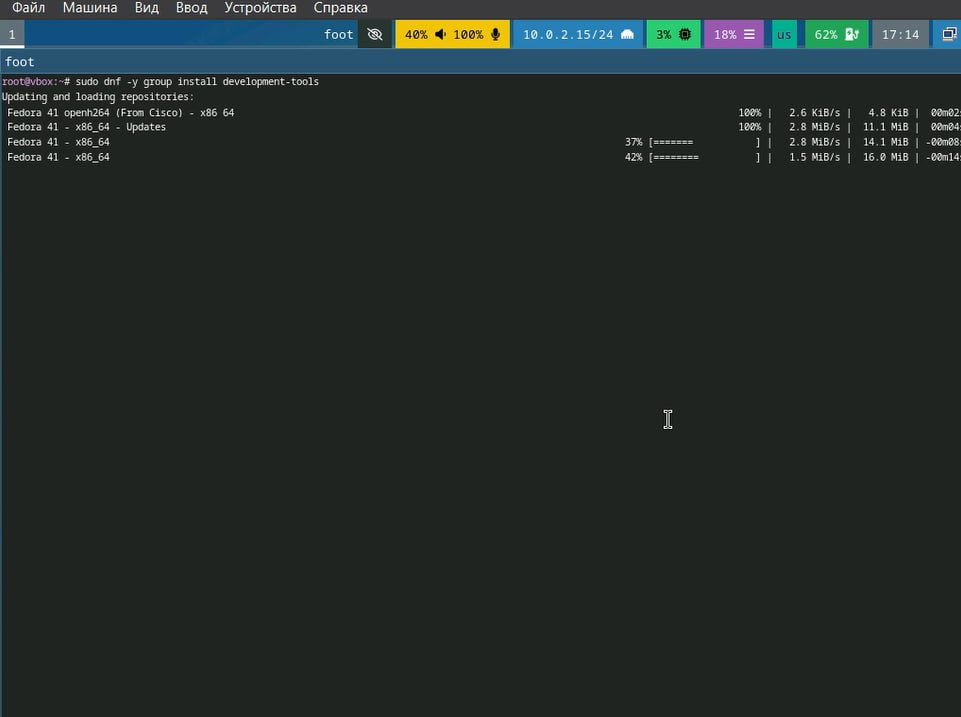
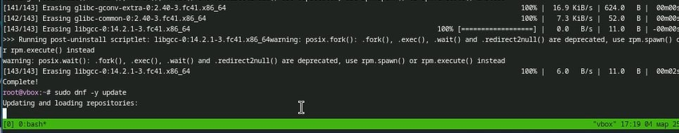
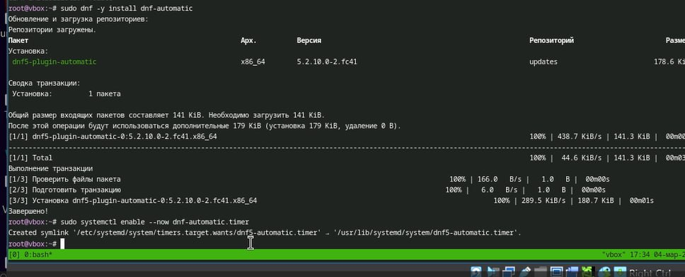
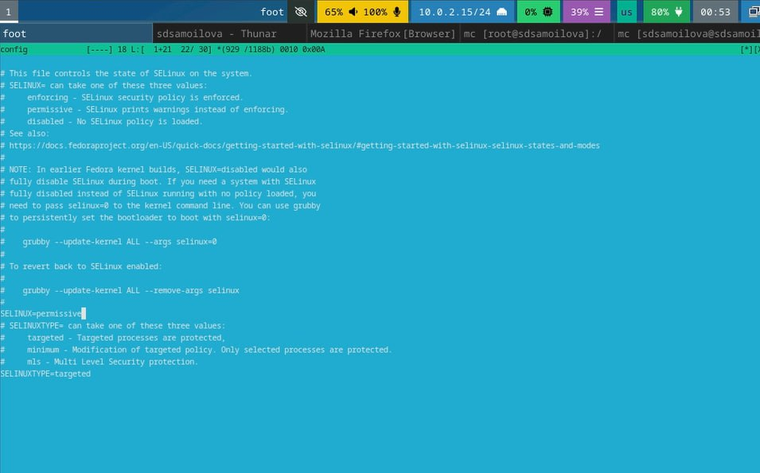
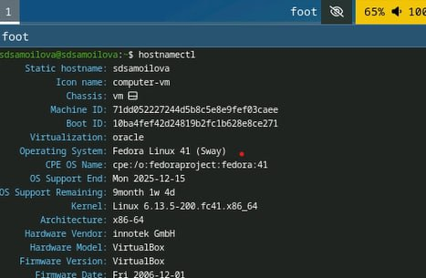

---
## Front matter
lang: ru-RU
title: Презентация
subtitle: Установка ОС
author:
  - Самойлова Софья
institute:
  - Российский университет дружбы народов, Москва, Россия
  - Объединённый институт ядерных исследований, Дубна, Россия
date: 07.03.2025

## i18n babel
babel-lang: russian
babel-otherlangs: english

## Formatting pdf
toc: false
toc-title: Содержание
slide_level: 2
aspectratio: 169
section-titles: true
theme: metropolis
header-includes:
 - \metroset{progressbar=frametitle,sectionpage=progressbar,numbering=fraction}
---

## Докладчик

  * Самойлова Софья Дмитриевна
  * студент, группа НКАбд-04-24
  * Российский университет дружбы народов
  * <https://github.com/sdsamoylova>

# Вводная часть

Операционная система (ОС) — это комплекс взаимосвязанных программ, предназначенных
для управления ресурсами компьютера и организации взаимодействия с пользователем.
Сегодня наиболее известными операционными системами являются ОС семейства Microsoft
Windows и UNIX-подобные системы.

## Объект и предмет исследования

- Операционная система Linux

## Цели и задачи

- Установка операционной системы Linux

## Шаги выполнения

1. Установка операционной системы
2. Настройка операционной системы

## Установка операционной системы

:::::::::::::: {.columns align=center}
::: {.column width="70%"}

Скачиваю необходимое программное ПО, VirtualBox уже был установлен, кроме него загружаю Fedora-Sway-Live-x86_64-41-1.4.iso Запускаю виртуальную машину, создаю новую.

:::
::: {.column width="30%"}

:::
::::::::::::::
## Установка операционной системы

:::::::::::::: {.columns align=center}
::: {.column width="60%"}

Настраиваю машину согласно указаниям

:::
::: {.column width="40%"}

:::
:::::::::::::

## Установка ВМ

:::::::::::::: {.columns align=center}
::: {.column width="60%"}

После того как машина запустилась, нажимаю *liveinst* и настраиваю машину перед установкой. 

:::
::: {.column width="40%"}

:::
:::::::::::::

# Настройка операционной системы

:::::::::::::: {.columns align=center}
::: {.column width="60%"}

Устанавливаю средства разработки 

:::
::: {.column width="40%"}

:::
:::::::::::::

## Настройка операционной системы

:::::::::::::: {.columns align=center}
::: {.column width="60%"}

Обновление пакетов

:::
::: {.column width="40%"}

:::
:::::::::::::

# Настройка операционной системы

:::::::::::::: {.columns align=center}
::: {.column width="60%"}

Устанавливаю автоматическое обновление и подключаю его 

:::
::: {.column width="40%"}

:::
:::::::::::::

## Настройка ОС

:::::::::::::: {.columns align=center}
::: {.column width="60%"}

Так как в данном курсе мы не будем рассматривать работу с системой безопасности SELinux, то отключим её.

:::
::: {.column width="40%"}

:::
:::::::::::::

## Настройка ОС

:::::::::::::: {.columns align=center}
::: {.column width="60%"}

Устанавливаю имя пользователя и название хоста 

:::
::: {.column width="40%"}

:::
:::::::::::::

## Результаты

- Успешная установка и настройка ОС 

## Итоговый слайд

Мы хорошо постарались.
