---
## Front matter
title: "Отчёт по лабораторной работе №1"
subtitle: "Дисциплина: Операционные системы"
author: "Самойлова Софья Дмитриевна"

## Generic otions
lang: ru-RU
toc-title: "Содержание"

## Bibliography
bibliography: bib/cite.bib
csl: pandoc/csl/gost-r-7-0-5-2008-numeric.csl

## Pdf output format
toc: true # Table of contents
toc-depth: 2
lof: true # List of figures
lot: true # List of tables
fontsize: 12pt
linestretch: 1.5
papersize: a4
documentclass: scrreprt
## I18n polyglossia
polyglossia-lang:
  name: russian
  options:
	- spelling=modern
	- babelshorthands=true
polyglossia-otherlangs:
  name: english
## I18n babel
babel-lang: russian
babel-otherlangs: english
## Fonts
mainfont: IBM Plex Serif
romanfont: IBM Plex Serif
sansfont: IBM Plex Sans
monofont: IBM Plex Mono
mathfont: STIX Two Math
mainfontoptions: Ligatures=Common,Ligatures=TeX,Scale=0.94
romanfontoptions: Ligatures=Common,Ligatures=TeX,Scale=0.94
sansfontoptions: Ligatures=Common,Ligatures=TeX,Scale=MatchLowercase,Scale=0.94
monofontoptions: Scale=MatchLowercase,Scale=0.94,FakeStretch=0.9
mathfontoptions:
## Biblatex
biblatex: true
biblio-style: "gost-numeric"
biblatexoptions:
  - parentracker=true
  - backend=biber
  - hyperref=auto
  - language=auto
  - autolang=other*
  - citestyle=gost-numeric
## Pandoc-crossref LaTeX customization
figureTitle: "Рис."
listingTitle: "Листинг"
lofTitle: "Список иллюстраций"
lolTitle: "Листинги"
## Misc options
indent: true
header-includes:
  - \usepackage{indentfirst}
  - \usepackage{float} # keep figures where there are in the text
  - \floatplacement{figure}{H} # keep figures where there are in the text
---

# Цель работы

Целью данной работы является приобретение практических навыков установки операционной системы на виртуальную машину, настройки минимально необходимых для дальнейшей работы сервисов.

# Задание

1. Установка операционной системы
2. Настройка операционной системы
3. Домашнее задание

# Выполнение лабораторной работы
## Установка ОС

Скачиваю необходимое программное ПО, VirtualBox уже был установлен, кроме него загружаю Fedora-Sway-Live-x86_64-41-1.4.iso Запускаю виртуальную машину, создаю новую. (рис. [-@fig:001]).

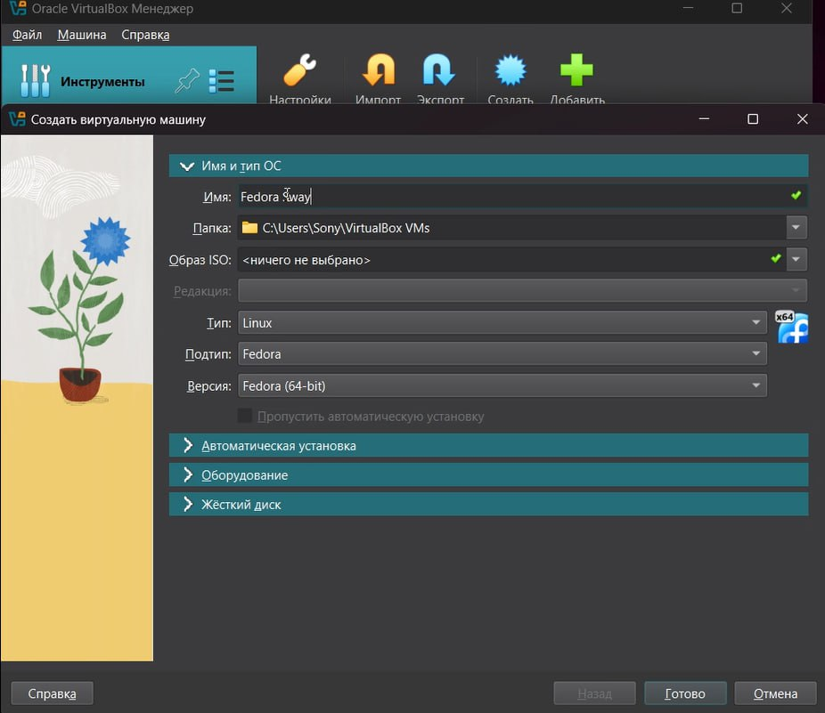{#fig:001 width=70%}

Настраиваю машину согласно указаниям (рис. [-@fig:002]).

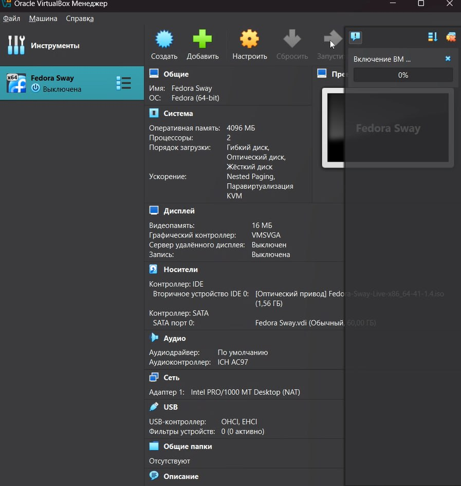{#fig:002 width=70%}

После того как машина запустилась, нажимаю *liveinst* и настраиваю машину перед установкой также согласно рекомендациям, данным в указаниях к выполнению лабораторной работы (рис. [-@fig:003])

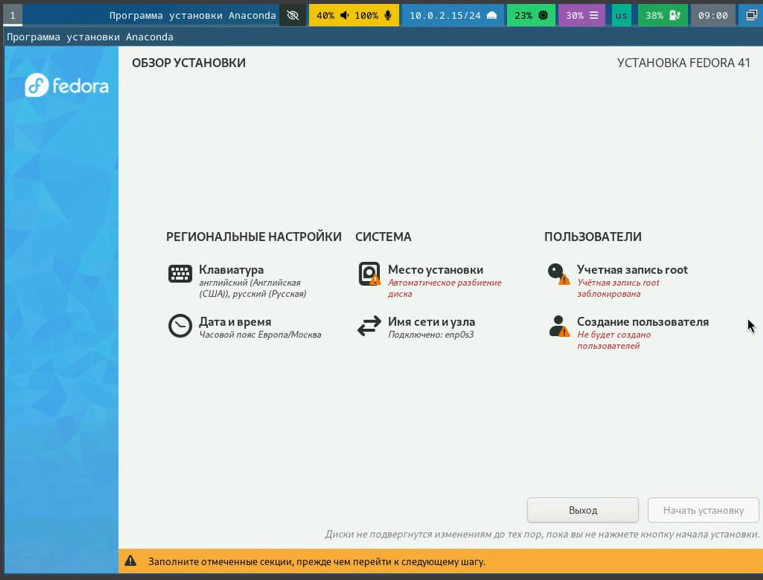{#fig:003 width=70%}

## Настройка операционной системы

Устанавливаю средства разработки (рис. [-@fig:004]).

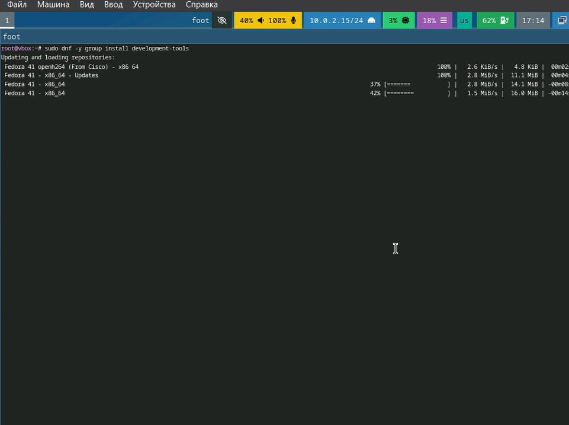{#fig:004 width=70%}

Обновляю пакеты (рис. [-@fig:005]).

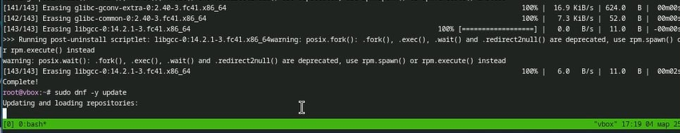{#fig:005 width=70%}

Устанавливаю автоматическое обновление и подключаю его (рис. [-@fig:006]).

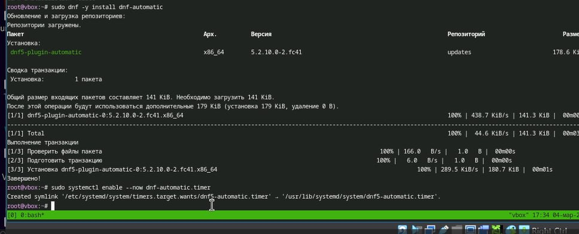{#fig:006 width=70%}

Так как в данном курсе мы не будем рассматривать работу с системой безопасности SELinux, то отключим её (рис. [-@fig:007]).

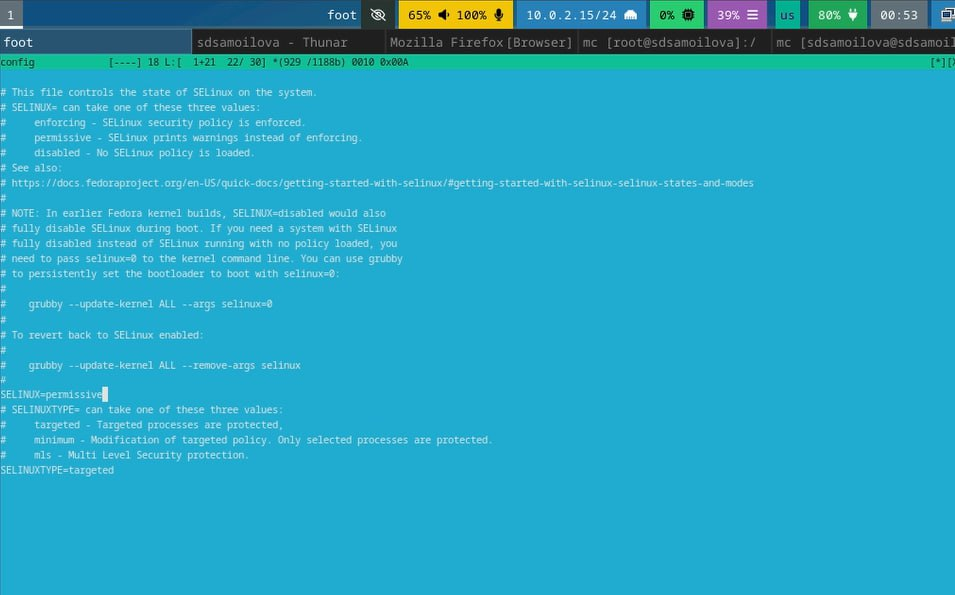{#fig:007 width=70%}

Устанавливаю имя пользователя и название хоста (рис. [-@fig:008]).

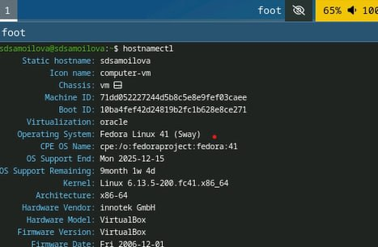{#fig:008 width=70%}

Для работы с языком разметки **Markdown** устанавливаю средство *pandoc* и дистрибутив *texlive*(рис. [-@fig:011]).

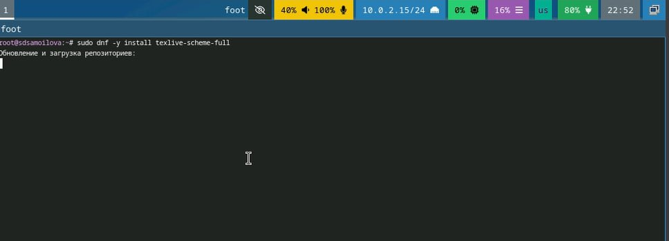{#fig:011 width=70%} 

## Домашнее задание 

При помощи команды *dmesg | grep -i "то, что ищем"* выполняю поиск по необходимым параметрам: (рис. [-@fig:009]).

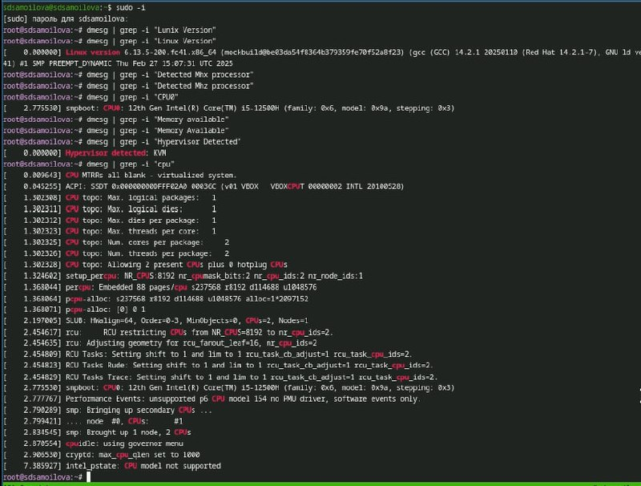{#fig:009 width=70%}

...продолжаю поиск...(рис. [-@fig:010]).

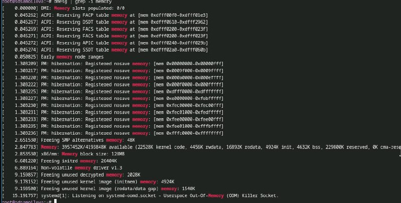{#fig:010 width=70%}

# Выводы

При выполнении лабораторной работы я приобрела практические навыки установки операционной системы на виртуальную машину, научилась устанавливать настройки минимально необходимых для дальнейшей работы сервисов.

# Список литературы{.unnumbered}

[Лабораторная работа 1](https://esystem.rudn.ru/mod/page/view.php?id=1224368#orgf88e4c8)
