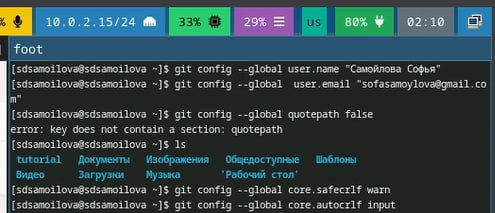
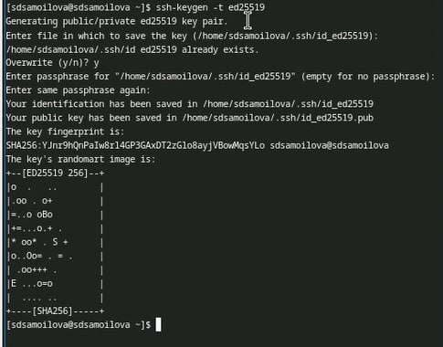
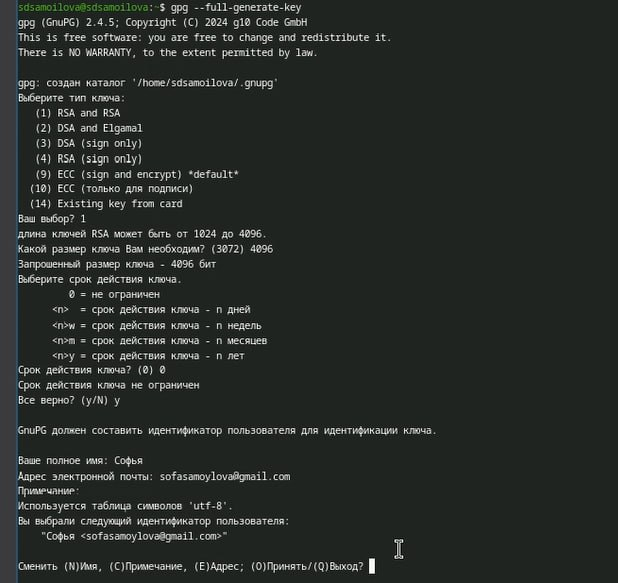
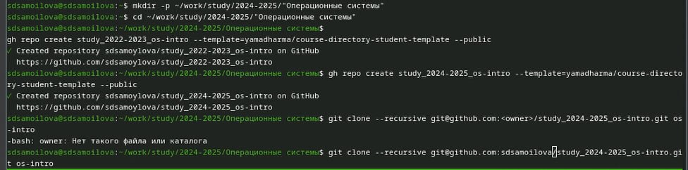
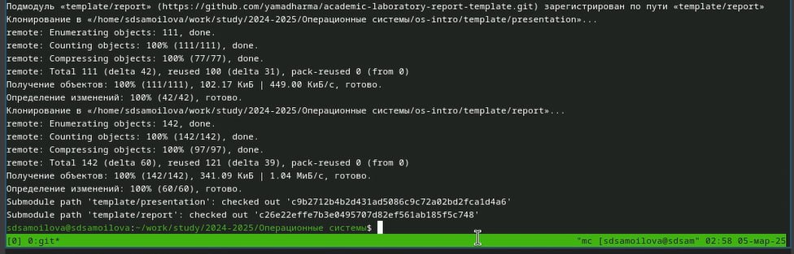

---
## Front matter
lang: ru-RU
title: Презентация
subtitle: Установка ОС
author:
  - Самойлова Софья
institute:
  - Российский университет дружбы народов, Москва, Россия
  - Объединённый институт ядерных исследований, Дубна, Россия
date: 08.03.2025

## i18n babel
babel-lang: russian
babel-otherlangs: english

## Formatting pdf
toc: false
toc-title: Содержание
slide_level: 2
aspectratio: 169
section-titles: true
theme: metropolis
header-includes:
 - \metroset{progressbar=frametitle,sectionpage=progressbar,numbering=fraction}
---

## Докладчик

  * Самойлова Софья Дмитриевна
  * студент, группа НКАбд-04-24
  * Российский университет дружбы народов
  * <https://github.com/sdsamoylova>

# Вводная часть

Системы контроля версий (Version Control System, VCS) применяются при работе нескольких человек над одним проектом. Обычно основное дерево проекта хранится в локальном или удалённом репозитории, к которому настроен доступ для участников проекта. При внесении изменений в содержание проекта система контроля версий позволяет их фиксировать, совмещать изменения, произведённые разными участниками проекта, производить откат к любой более ранней версии проекта, если это требуется.

## Объект и предмет исследования

- GitHub

## Цели и задачи

- Изучить идеологию и применение средств контроля версий.
- Освоить умения по работе с git.

## Шаги выполнения

1. Установка программного обеспечения. Базовая настройка *git*
2. Создание ключей *SSH* и *PGP* и добавление их на GitHub
3. Создание шаблона для рабочего пространства

## Установка ПО. Настройка git

:::::::::::::: {.columns align=center}
::: {.column width="70%"}

Задаю имя и email владельца репозитория, добавляю параметры

:::
::: {.column width="30%"}

:::
::::::::::::::
## Создание ключа SSH 

:::::::::::::: {.columns align=center}
::: {.column width="60%"}

Создание ключа SSH

:::
::: {.column width="40%"}

:::
:::::::::::::

## Создание ключа PGP

:::::::::::::: {.columns align=center}
::: {.column width="60%"}

Создание ключа SSH

:::
::: {.column width="40%"}

:::
:::::::::::::

# Создание шаблона

:::::::::::::: {.columns align=center}
::: {.column width="60%"}

Создание шаблона рабочего простраснства и подготовка каталогов  

:::
::: {.column width="40%"}

:::
:::::::::::::

## Успешное перемещение шаблона на GitHub

:::::::::::::: {.columns align=center}
::: {.column width="60%"}

Проверка, что у нас получилось создать шаблон и перенести его на GitHub

:::
::: {.column width="40%"}

:::
:::::::::::::

## Результаты

- Успешное создание ключей и шаблона 

## Итоговый слайд

Мы хорошо постарались :)
