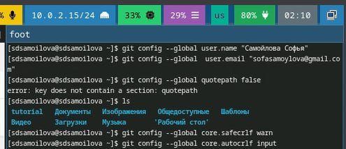

---
## Front matter
title: "Отчёт по лабораторной работе №2"
subtitle: "Дисциплина: Операционные системы"
author: "Самойлова Софья Дмитриевна"

## Generic otions
lang: ru-RU
toc-title: "Содержание"

## Bibliography
bibliography: bib/cite.bib
csl: pandoc/csl/gost-r-7-0-5-2008-numeric.csl

## Pdf output format
toc: true # Table of contents
toc-depth: 2
lof: true # List of figures
fontsize: 12pt
linestretch: 1.5
papersize: a4
documentclass: scrreprt
## I18n polyglossia
polyglossia-lang:
  name: russian
  options:
	- spelling=modern
	- babelshorthands=true
polyglossia-otherlangs:
  name: english
## I18n babel
babel-lang: russian
babel-otherlangs: english
## Fonts
mainfont: IBM Plex Serif
romanfont: IBM Plex Serif
sansfont: IBM Plex Sans
monofont: IBM Plex Mono
mathfont: STIX Two Math
mainfontoptions: Ligatures=Common,Ligatures=TeX,Scale=0.94
romanfontoptions: Ligatures=Common,Ligatures=TeX,Scale=0.94
sansfontoptions: Ligatures=Common,Ligatures=TeX,Scale=MatchLowercase,Scale=0.94
monofontoptions: Scale=MatchLowercase,Scale=0.94,FakeStretch=0.9
mathfontoptions:
## Biblatex
biblatex: true
biblio-style: "gost-numeric"
biblatexoptions:
  - parentracker=true
  - backend=biber
  - hyperref=auto
  - language=auto
  - autolang=other*
  - citestyle=gost-numeric
## Pandoc-crossref LaTeX customization
figureTitle: "Рис."
listingTitle: "Листинг"
lofTitle: "Список иллюстраций"
lolTitle: "Листинги"
## Misc options
indent: true
header-includes:
  - \usepackage{indentfirst}
  - \usepackage{float} # keep figures where there are in the text
  - \floatplacement{figure}{H} # keep figures where there are in the text
---

# Цель работы

Целью данной работы является изучение идеологии и применение средств контроля версий, а так же освоение умения по работе с git.

# Задание

1. Установка программного обеспечения. Базовая настройка *git*
2. Создание ключей *SSH* и *PGP* и добавление их на GitHub 
3. Создание шаблона для рабочего пространства

# Теоретическое введение

Системы контроля версий (*Version Control System, VCS*) применяются при работе нескольких человек над одним проектом. Обычно основное дерево проекта хранится в локальном или удалённом репозитории, к которому настроен доступ для участников проекта. При внесении изменений в содержание проекта система контроля версий позволяет их фиксировать, совмещать изменения, произведённые разными участниками проекта, производить откат к любой более ранней версии проекта, если это требуется.

# Выполнение лабораторной работы

## Установка программного обеспечения. Базовая настройка *git*

Необходимое ПО устанавливаю командами `dnf install git` и `dnf install gh`

Задаю имя и email владельца репозитория, добавляю параметры (рис. [-@fig:001]).

{#fig:001 width=70%}

## Создание ключей *SSH* и *PGP* и добавление их на GitHub 

Создаю ключ SSH (рис. [-@fig:002]).

{#fig:002 width=70%}

И добавляю его на *GitHub* (рис. [-@fig:003]).

{#fig:003 width=70%}

Создаю ключ PGP (рис. [-@fig:004]).

{#fig:004 width=70%}

И добавляю его на *GitHub* (рис. [-@fig:006]).

{#fig:006 width=70%}

Настраиваю автоматические подписи коммитов git (рис. [-@fig:007]).

{#fig:007 width=70%}

Делаю авторизацию на *GitHub* при помощи `gh auth login`(рис. [-@fig:008]).

{#fig:008 width=70%}

Результат выполнения команды (рис. [-@fig:009]).

{#fig:009 width=70%}

## Создание шаблона для рабочего пространства

Создаю шаблон рабочего пространства, заранее подготовив путь их расположения (рис. [-@fig:010]).

{#fig:010 width=70%}

Перехожу в каталог курса, удаляю лишние файлы и создаю необходимые каталоги и отправляю файлы на сервер (рис. [-@fig:012]).

{#fig:012 width=70%}

Проверяю, что всё было добавлено на GitHub (рис. [-@fig:013]).

{#fig:013 width=70%}

# Выводы

Я изучила идеологии и применение средств контроля версий, а так же освоила умения по работе с git.

# Список литературы
 
https://esystem.rudn.ru/mod/page/view.php?id=1224371#org2151722
