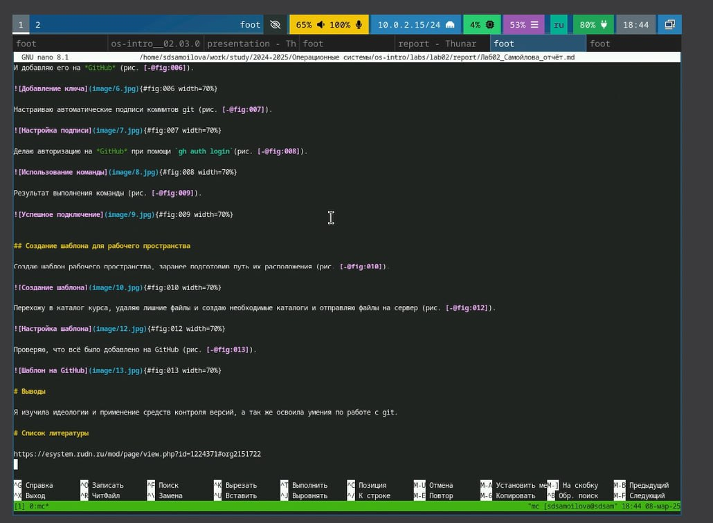

---
## Front matter
lang: ru-RU
title: Презентация
subtitle: Установка ОС
author:
  - Самойлова Софья
institute:
  - Российский университет дружбы народов, Москва, Россия
  - Объединённый институт ядерных исследований, Дубна, Россия
date: 08.03.2025

## i18n babel
babel-lang: russian
babel-otherlangs: english

## Formatting pdf
toc: false
toc-title: Содержание
slide_level: 2
aspectratio: 169
section-titles: true
theme: metropolis
header-includes:
 - \metroset{progressbar=frametitle,sectionpage=progressbar,numbering=fraction}
---

## Докладчик

  * Самойлова Софья Дмитриевна
  * студент, группа НКАбд-04-24
  * Российский университет дружбы народов
  * <https://github.com/sdsamoylova>

# Вводная часть

Markdown — это легкий язык разметки, который позволяет форматировать текст с помощью простых символов. Он используется для создания структурированного текста, который легко читается в исходном виде и преобразуется в HTML для веб-страниц. Markdown поддерживает заголовки, списки, ссылки, изображения и другие элементы форматирования, что делает его популярным среди писателей, разработчиков и блогеров.

## Объект и предмет исследования

- Markdown

## Цели и задачи

- Освоить умения по работе с Markdown

## Шаги выполнения

1. Создание отчёта с помощью Markdown

## Создание отчёта

:::::::::::::: {.columns align=center}
::: {.column width="70%"}

Создаю отчёт с помощью Markdown

:::
::: {.column width="30%"}

:::
::::::::::::::

## Итоговый слайд

Мы хорошо постарались :)
