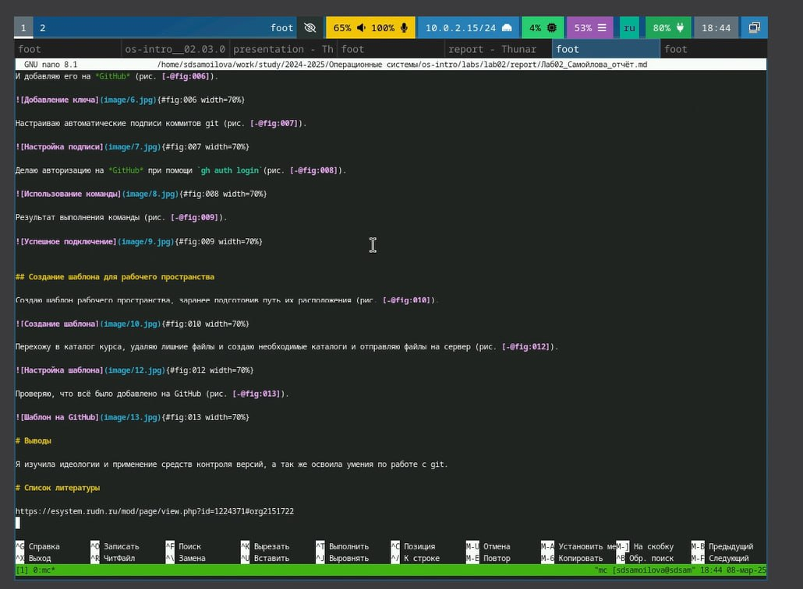

---
## Front matter
title: "Отчёт по лабораторной работе №3"
subtitle: "Дисциплина: Операционные системы"
author: "Самойлова Софья Дмитриевна"

## Generic otions
lang: ru-RU
toc-title: "Содержание"

## Bibliography
bibliography: bib/cite.bib
csl: pandoc/csl/gost-r-7-0-5-2008-numeric.csl

## Pdf output format
toc: true # Table of contents
toc-depth: 2
lof: true # List of figures
fontsize: 12pt
linestretch: 1.5
papersize: a4
documentclass: scrreprt
## I18n polyglossia
polyglossia-lang:
  name: russian
  options:
	- spelling=modern
	- babelshorthands=true
polyglossia-otherlangs:
  name: english
## I18n babel
babel-lang: russian
babel-otherlangs: english
## Fonts
mainfont: IBM Plex Serif
romanfont: IBM Plex Serif
sansfont: IBM Plex Sans
monofont: IBM Plex Mono
mathfont: STIX Two Math
mainfontoptions: Ligatures=Common,Ligatures=TeX,Scale=0.94
romanfontoptions: Ligatures=Common,Ligatures=TeX,Scale=0.94
sansfontoptions: Ligatures=Common,Ligatures=TeX,Scale=MatchLowercase,Scale=0.94
monofontoptions: Scale=MatchLowercase,Scale=0.94,FakeStretch=0.9
mathfontoptions:
## Biblatex
biblatex: true
biblio-style: "gost-numeric"
biblatexoptions:
  - parentracker=true
  - backend=biber
  - hyperref=auto
  - language=auto
  - autolang=other*
  - citestyle=gost-numeric
## Pandoc-crossref LaTeX customization
figureTitle: "Рис."
listingTitle: "Листинг"
lofTitle: "Список иллюстраций"
lolTitle: "Листинги"
## Misc options
indent: true
header-includes:
  - \usepackage{indentfirst}
  - \usepackage{float} # keep figures where there are in the text
  - \floatplacement{figure}{H} # keep figures where there are in the text
---

# Цель работы

Целью данной работы является изучение легковесного языка разметки *Markdown*.

# Задание

Создать отчёт по предыдущей лабораторной работе в формате *Markdown*.

# Теоретическое введение

*Markdown* — это легкий язык разметки, который позволяет форматировать текст с помощью простых символов. Он используется для создания структурированного текста, который легко читается в исходном виде и преобразуется в HTML для веб-страниц. *Markdown* поддерживает заголовки, списки, ссылки, изображения и другие элементы форматирования, что делает его популярным среди писателей, разработчиков и блогеров.

# Выполнение лабораторной работы

Создание отчёта по лабораторной работе №2 (рис. [-@fig:001]).

{#fig:001 width=70%}

# Выводы

Я изучила легковесный язык разметки *Markdown*.

# Список литературы
 
https://esystem.rudn.ru/pluginfile.php/2586858/mod_resource/content/3/003-lab_markdown.pdf