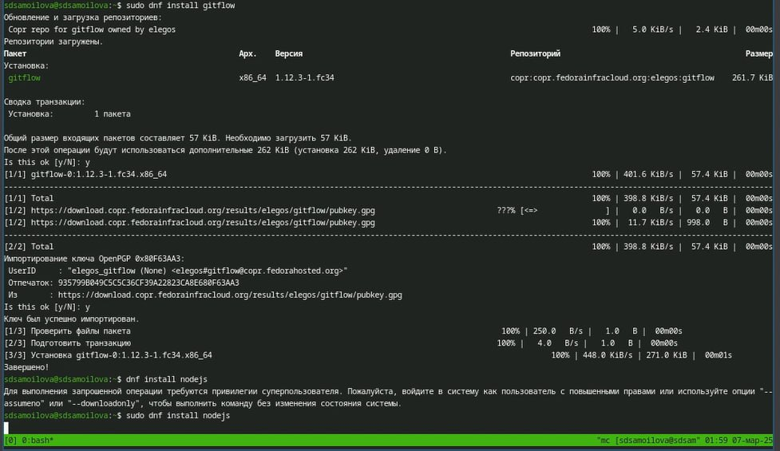
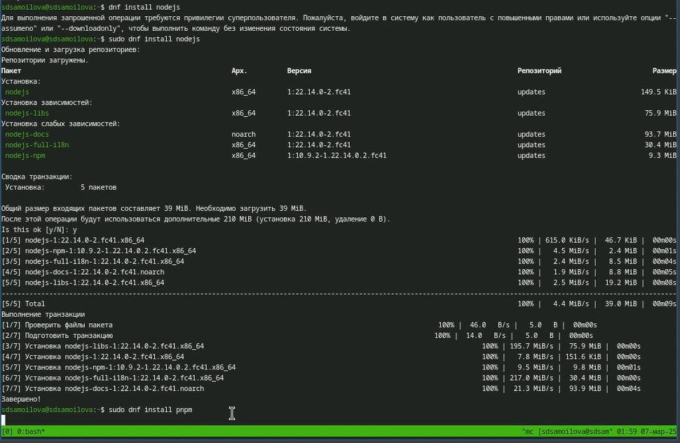
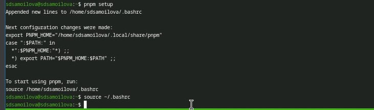
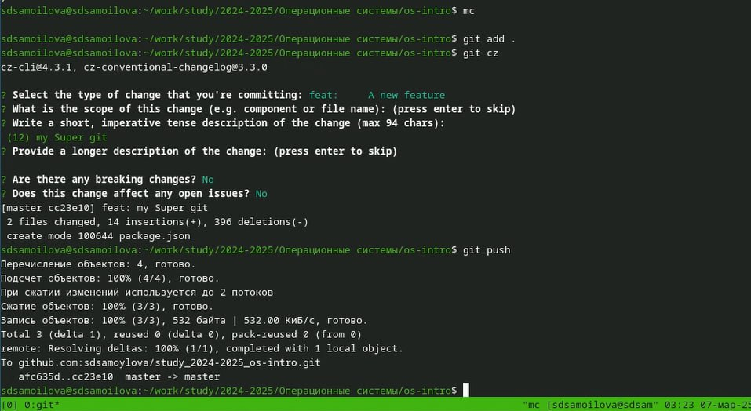
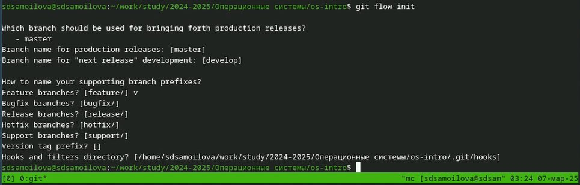
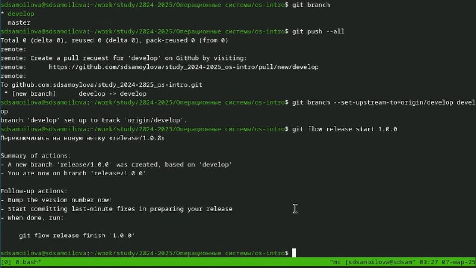
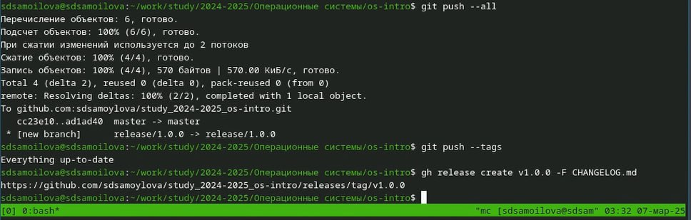

---
## Front matter
lang: ru-RU
title: Презентация
subtitle: Работа с git-flow
author:
  - Самойлова Софья
institute:
  - Российский университет дружбы народов, Москва, Россия
  - Объединённый институт ядерных исследований, Дубна, Россия
date: 07.03.2025

## i18n babel
babel-lang: russian
babel-otherlangs: english

## Formatting pdf
toc: false
toc-title: Содержание
slide_level: 2
aspectratio: 169
section-titles: true
theme: metropolis
header-includes:
 - \metroset{progressbar=frametitle,sectionpage=progressbar,numbering=fraction}
---

## Докладчик

  * Самойлова Софья Дмитриевна
  * студент, группа НКАбд-04-24
  * Российский университет дружбы народов
  * <https://github.com/sdsamoylova>

# Вводная часть

- Gitflow Workflow опубликована и популяризована Винсентом Дриссеном.
- Gitflow Workflow предполагает выстраивание строгой модели ветвления с учётом выпуска проекта.
Данная модель отлично подходит для организации рабочего процесса на основе релизов.
Работа по модели Gitflow включает создание отдельной ветки для исправлений ошибок в рабочей среде.

## Объект и предмет исследования

- Репозиторий GitHub

## Цели и задачи

Целью данной работы является получение навыков правильной работы с репозиториями `git`.

## Шаги выполнения

1. Установка и настройка программного обеспечения
2. Практический сценарий использования git
3. Работа с репозиторием git

## 1. Установка и настройка программного обеспечения

:::::::::::::: {.columns align=center}
::: {.column width="70%"}

Установка `git-flow` и `Node.js` 

:::
::: {.column width="30%"}

:::
::::::::::::::

## Установка ПО

:::::::::::::: {.columns align=center}
::: {.column width="60%"}

Запускаю `pnpm` и логинюсь 

:::
::: {.column width="40%"}

:::
:::::::::::::

## Установка ВМ

:::::::::::::: {.columns align=center}
::: {.column width="60%"}

Делаю конфигурацию пакетов Node.js, редактирую команду для формирования коммитов и добавляю новые файлы 

:::
::: {.column width="40%"}

:::
:::::::::::::

# Настройка операционной системы

:::::::::::::: {.columns align=center}
::: {.column width="60%"}

Устанавливаю средства разработки 

:::
::: {.column width="40%"}

:::
:::::::::::::

## Настройка операционной системы

:::::::::::::: {.columns align=center}
::: {.column width="60%"}

Обновление пакетов

:::
::: {.column width="40%"}

:::
:::::::::::::

# Настройка операционной системы

:::::::::::::: {.columns align=center}
::: {.column width="60%"}

Устанавливаю автоматическое обновление и подключаю его 

:::
::: {.column width="40%"}

:::
:::::::::::::

## Настройка ОС

:::::::::::::: {.columns align=center}
::: {.column width="60%"}

Так как в данном курсе мы не будем рассматривать работу с системой безопасности SELinux, то отключим её.

:::
::: {.column width="40%"}

:::
:::::::::::::

## Результаты

- Успешное обучение git flow 

## Итоговый слайд

Мы хорошо постарались.
