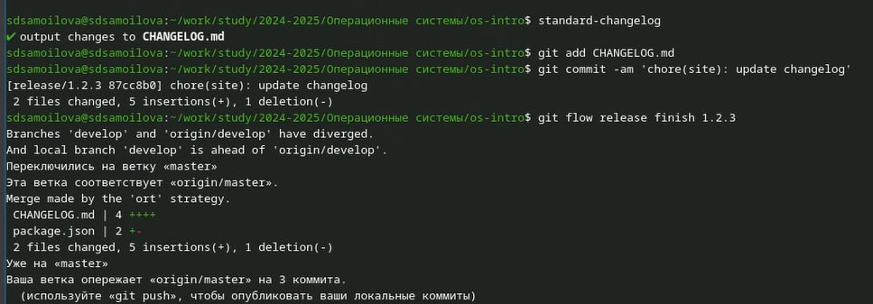

---
## Front matter
title: "Отчёт по лабораторной работе №4"
subtitle: "Дисциплина: Операционные системы"
author: "Самойлова Софья Дмитриевна"

## Generic otions
lang: ru-RU
toc-title: "Содержание"

## Bibliography
bibliography: bib/cite.bib
csl: pandoc/csl/gost-r-7-0-5-2008-numeric.csl

## Pdf output format
toc: true # Table of contents
toc-depth: 2
lof: true # List of figures
fontsize: 12pt
linestretch: 1.5
papersize: a4
documentclass: scrreprt
## I18n polyglossia
polyglossia-lang:
  name: russian
  options:
	- spelling=modern
	- babelshorthands=true
polyglossia-otherlangs:
  name: english
## I18n babel
babel-lang: russian
babel-otherlangs: english
## Fonts
mainfont: IBM Plex Serif
romanfont: IBM Plex Serif
sansfont: IBM Plex Sans
monofont: IBM Plex Mono
mathfont: STIX Two Math
mainfontoptions: Ligatures=Common,Ligatures=TeX,Scale=0.94
romanfontoptions: Ligatures=Common,Ligatures=TeX,Scale=0.94
sansfontoptions: Ligatures=Common,Ligatures=TeX,Scale=MatchLowercase,Scale=0.94
monofontoptions: Scale=MatchLowercase,Scale=0.94,FakeStretch=0.9
mathfontoptions:
## Biblatex
biblatex: true
biblio-style: "gost-numeric"
biblatexoptions:
  - parentracker=true
  - backend=biber
  - hyperref=auto
  - language=auto
  - autolang=other*
  - citestyle=gost-numeric
## Pandoc-crossref LaTeX customization
figureTitle: "Рис."
listingTitle: "Листинг"
lofTitle: "Список иллюстраций"
lolTitle: "Листинги"
## Misc options
indent: true
header-includes:
  - \usepackage{indentfirst}
  - \usepackage{float} # keep figures where there are in the text
  - \floatplacement{figure}{H} # keep figures where there are in the text
---

# Цель работы

Целью данной работы является получение навыков правильной работы с репозиториями `git`.

# Задание

1. Установка и настройка программного обеспечения
2. Практический сценарий использования git
3. Работа с репозиторием git

# Теоретическое введение

- Gitflow Workflow опубликована и популяризована Винсентом Дриссеном.
- Gitflow Workflow предполагает выстраивание строгой модели ветвления с учётом выпуска проекта.
Данная модель отлично подходит для организации рабочего процесса на основе релизов.
Работа по модели Gitflow включает создание отдельной ветки для исправлений ошибок в рабочей среде.
Последовательность действий при работе по модели Gitflow:
-Из ветки master создаётся ветка develop.
-Из ветки develop создаётся ветка release.
-Из ветки develop создаются ветки feature.
-Когда работа над веткой feature завершена, она сливается с веткой develop.
-Когда работа над веткой релиза release завершена, она сливается в ветки develop и master.
-Если в master обнаружена проблема, из master создаётся ветка hotfix.
-Когда работа над веткой исправления hotfix завершена, она сливается в ветки develop и master.

# Выполнение лабораторной работы

## Установка и настройка программного обеспечения

Установка `git-flow` и `Node.js` (рис. [-@fig:001]).

{#fig:001 width=70%}

Установка `pnpm` (рис. [-@fig:002]).

{#fig:002 width=70%}

Запускаю `pnpm` и логинюсь (рис. [-@fig:003]).

{#fig:003 width=70%}

Делаю конфигурацию пакетов Node.js, редактирую команду для формирования коммитов и добавляю новые файлы (рис. [-@fig:004]).

{#fig:004 width=70%}

Инициализирую git-flow (рис. [-@fig:005]).

{#fig:005 width=70%}

Проверяю, что нахожусь на ветке develop, загружаю весь репозиторий в хранилище, устанавливаю внешнюю ветку как вышестоящую для этой ветки, создаю релиз с версией 1.0.0. (рис. [-@fig:006]).

{#fig:006 width=70%}

Отправляю данные на GitHub (рис. [-@fig:007]).

{#fig:007 width=70%}

Обновляю номер версии в файле `package.json` на "1.2.3" (рис. [-@fig:008]).

{#fig:008 width=70%}

Создаю релиз с новой версией, журнал изменений, добавляю журнал в индекс, делаю слияние двух веток (рис. [-@fig:009]).

{#fig:009 width=70%}

Отправляю данные на GitHub и создаю релиз с комментарием из журнала изменений (рис. [-@fig:010]).

{#fig:010 width=70%}

# Выводы

Я освоила навыки правильной работы с репозиториями git.

# Список литературы
 
https://esystem.rudn.ru/mod/page/view.php?id=1224375#orgc6b2fbf