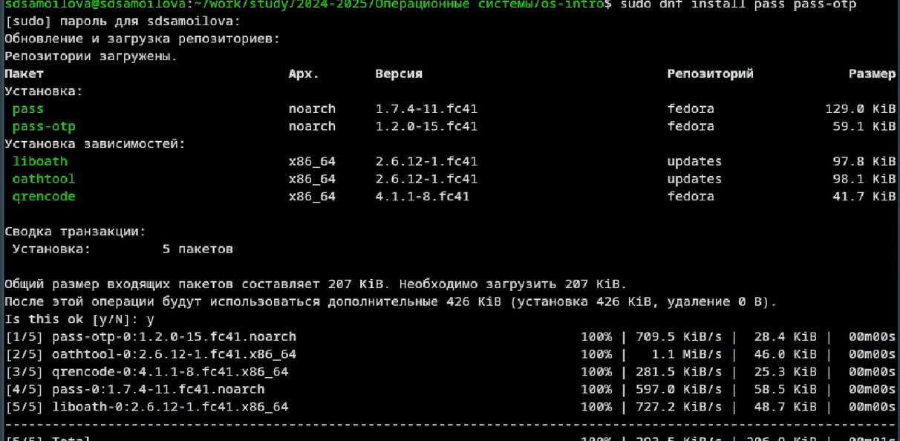
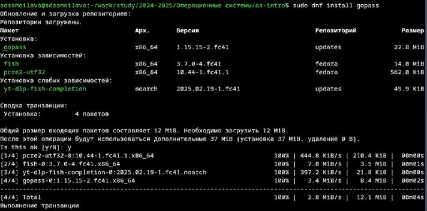
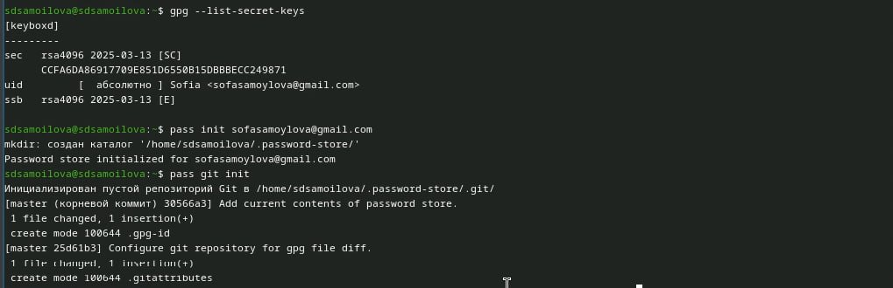
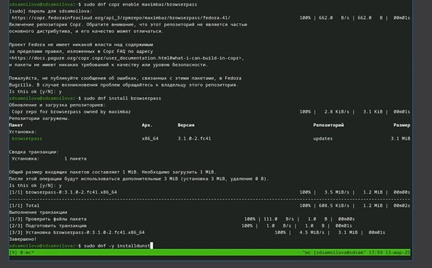

---
## Front matter
lang: ru-RU
title: Презентация
subtitle: Работа с pass
author:
  - Самойлова Софья
institute:
  - Российский университет дружбы народов, Москва, Россия
  - Объединённый институт ядерных исследований, Дубна, Россия

## i18n babel
babel-lang: russian
babel-otherlangs: english

## Formatting pdf
toc: false
toc-title: Содержание
slide_level: 2
aspectratio: 169
section-titles: true
theme: metropolis
header-includes:
 - \metroset{progressbar=frametitle,sectionpage=progressbar,numbering=fraction}
---

## Докладчик

  * Самойлова Софья Дмитриевна
  * студент, группа НКАбд-04-24
  * Российский университет дружбы народов
  * <https://github.com/sdsamoylova>

# Вводная часть

Менеджер паролей pass — программа, сделанная в рамках идеологии Unix.Также носит название стандартного менеджера паролей для Unix (The standard Unix password manager).

Основные свойства

• Данные хранятся в файловой системе в виде каталогов и файлов.
• Файлы шифруются с помощью GPG-ключа. 

## Структура базы паролей

• Структура базы может быть произвольной, если Вы собираетесь использовать её напрямую, без промежуточного программного обеспечения. Тогда семантику структуры базы данных Вы держите в своей голове.

• Если же необходимо использовать дополнительное программное обеспечение, необходимо семантику заложить в структуру базы паролей. chezmoi используется для управления файлами конфигурации домашнего каталога пользователя.

## Объект и предмет исследования

- Менеджер паролей pass

## Цели и задачи

Целью данной работы является получение навыков правильной работы с менеджером паролей pass.

## Шаги выполнения

1. Установка и настройка программного обеспечения
2. Практический сценарий использования git
3. Работа с репозиторием git

## 1. Установка и настройка программного обеспечения

:::::::::::::: {.columns align=center}
::: {.column width="70%"}

Установка` pass` и `gopass`

:::
::: {.column width="30%"}

:::
::::::::::::::

## Установка ПО

:::::::::::::: {.columns align=center}
::: {.column width="60%"}

Установка продолжение 

:::
::: {.column width="40%"}

:::
:::::::::::::

## Проверка git 

:::::::::::::: {.columns align=center}
::: {.column width="60%"}

Просматриваю список ключей и делаю инициализацию хранилища 

:::
::: {.column width="40%"}

:::
:::::::::::::

## Установка дополнительного ПО

:::::::::::::: {.columns align=center}
::: {.column width="60%"}

Устанавливаю необходимые утилиты 

:::
::: {.column width="40%"}

:::
:::::::::::::

## Результаты

- Успешное обучение работы с менеджером `gopass` 

## Итоговый слайд

Мы хорошо постарались.
