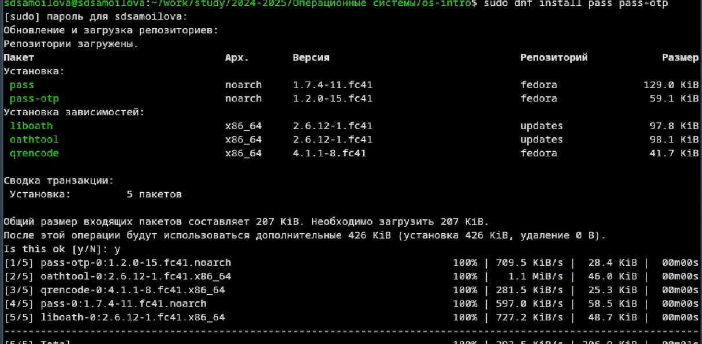
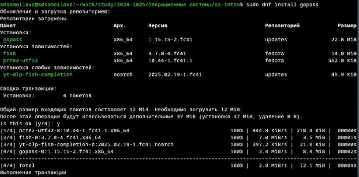
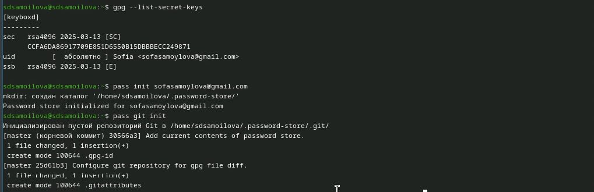
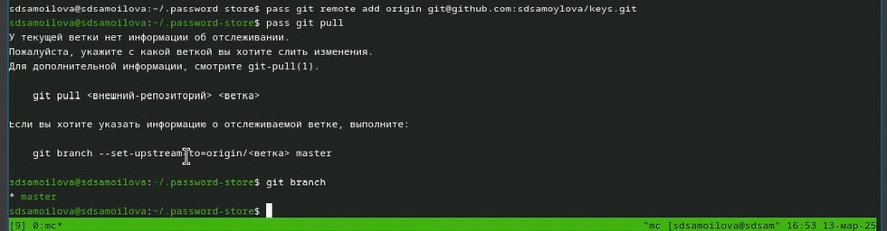
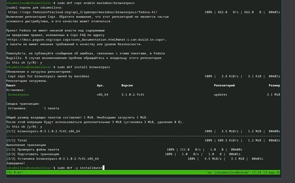

---
## Front matter
title: "Отчёт по лабораторной работе №5"
subtitle: "Дисциплина: Операционные системы"
author: "Самойлова Софья Дмитриевна"

## Generic otions
lang: ru-RU
toc-title: "Содержание"

## Bibliography
bibliography: bib/cite.bib
csl: pandoc/csl/gost-r-7-0-5-2008-numeric.csl

## Pdf output format
toc: true # Table of contents
toc-depth: 2
lof: true # List of figures
fontsize: 12pt
linestretch: 1.5
papersize: a4
documentclass: scrreprt
## I18n polyglossia
polyglossia-lang:
  name: russian
  options:
	- spelling=modern
	- babelshorthands=true
polyglossia-otherlangs:
  name: english
## I18n babel
babel-lang: russian
babel-otherlangs: english
## Fonts
mainfont: IBM Plex Serif
romanfont: IBM Plex Serif
sansfont: IBM Plex Sans
monofont: IBM Plex Mono
mathfont: STIX Two Math
mainfontoptions: Ligatures=Common,Ligatures=TeX,Scale=0.94
romanfontoptions: Ligatures=Common,Ligatures=TeX,Scale=0.94
sansfontoptions: Ligatures=Common,Ligatures=TeX,Scale=MatchLowercase,Scale=0.94
monofontoptions: Scale=MatchLowercase,Scale=0.94,FakeStretch=0.9
mathfontoptions:
## Biblatex
biblatex: true
biblio-style: "gost-numeric"
biblatexoptions:
  - parentracker=true
  - backend=biber
  - hyperref=auto
  - language=auto
  - autolang=other*
  - citestyle=gost-numeric
## Pandoc-crossref LaTeX customization
figureTitle: "Рис."
listingTitle: "Листинг"
lofTitle: "Список иллюстраций"
lolTitle: "Листинги"
## Misc options
indent: true
header-includes:
  - \usepackage{indentfirst}
  - \usepackage{float} # keep figures where there are in the text
  - \floatplacement{figure}{H} # keep figures where there are in the text
---

# Цель работы

Целью данной работы является ознакомление с `pass, gopass, native messaging, chezmoi`.

# Задание

1. Установить дополнительное ПО
2. Установить и настроить pass
3. Настроить интерфейс с браузером
4. Сохранить пароль
5. Установить и настроить chezmoi
6. Настроить chezmoi на новой машине
7. Выполнить ежедневные операции с chezmoi

# Теоретическое введение

Менеджер паролей pass — программа, сделанная в рамках идеологии Unix. Также носит название стандартного менеджера паролей для Unix (The standard Unix password manager).

Основные свойства

- Данные хранятся в файловой системе в виде каталогов и файлов.
- Файлы шифруются с помощью GPG-ключа.

 Структура базы паролей

- Структура базы может быть произвольной, если Вы собираетесь использовать её напрямую, без промежуточного программного обеспечения. Тогда семантику структуры базы данных Вы держите в своей голове.
- Если же необходимо использовать дополнительное программное обеспечение, необходимо семантику заложить в структуру базы паролей.
chezmoi используется для управления файлами конфигурации домашнего каталога пользователя. 
Конфигурация chezmoi

Рабочие файлы

- Состояние файлов конфигурации сохраняется в каталоге ~/.local/share/chezmoi. Он является клоном вашего репозитория dotfiles.
- Файл конфигурации ~/.config/chezmoi/chezmoi.toml (можно использовать также JSON или YAML) специфичен для локальной машины.
- Файлы, содержимое которых одинаково на всех ваших машинах, дословно копируются из исходного каталога.
- Файлы, которые варьируются от машины к машине, выполняются как шаблоны, обычно с использованием данных из файла конфигурации локальной машины для настройки конечного содержимого, специфичного для локальной машины.

# Выполнение лабораторной работы

Установка `pass` и `gopass` (рис. [-@fig:001]). (рис. [-@fig:002]).

{#fig:001 width=70%}

{#fig:002 width=70%}

Просматриваю список ключей и делаю инициализацию хранилища (рис. [-@fig:003]).

{#fig:003 width=70%}

Синхронизирую с `git` (рис. [-@fig:004]).

{#fig:004 width=70%}

Устанавливаю дополнительное ПО: (рис. [-@fig:005])

`sudo dnf -y install \dunst \fontawesome-fonts \powerline-fonts \light \fuzzel \swaylock \kitty \waybar swaybg \wl-clipboard \mpv \grim \slurp`

{#fig:005 width=70%}

# Выводы

Мы познакомились с `pass, gopass, native messaging, chezmoi`. Научились пользоваться этими утилитами, синхронизировали их с гит.

# Список литературы
 
https://esystem.rudn.ru/mod/page/view.php?id=1224377
