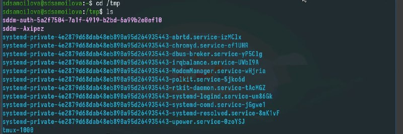
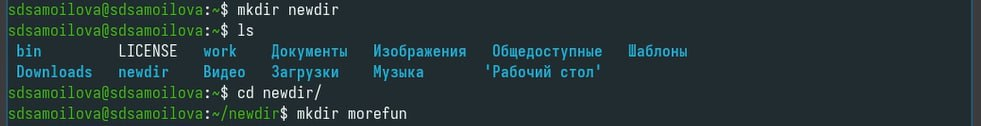
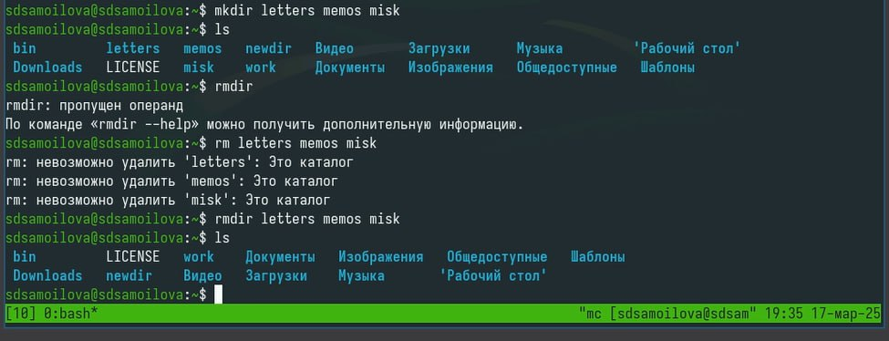

---
## Front matter
lang: ru-RU
title: Презентация
subtitle: Работа с консолью
author:
  - Самойлова Софья
institute:
  - Российский университет дружбы народов, Москва, Россия
## i18n babel
babel-lang: russian
babel-otherlangs: english

## Formatting pdf
toc: false
toc-title: Содержание
slide_level: 2
aspectratio: 169
section-titles: true
theme: metropolis
header-includes:
 - \metroset{progressbar=frametitle,sectionpage=progressbar,numbering=fraction}
---

## Докладчик

  * Самойлова Софья Дмитриевна
  * студент, группа НКАбд-04-24
  * Российский университет дружбы народов
  * <https://github.com/sdsamoylova>

# Вводная часть

В операционной системе типа Linux взаимодействие пользователя с системой обычно
осуществляется с помощью командной строки посредством построчного ввода ко-
манд. При этом обычно используется командные интерпретаторы языка shell: /bin/sh;
/bin/csh; /bin/ksh. 

## Формат команды

Командой в операционной системе называется записанный по
специальным правилам текст (возможно с аргументами), представляющий собой ука-
зание на выполнение какой-либо функций (или действий) в операционной системе.
Обычно первым словом идёт имя команды, остальной текст — аргументы или опции,
конкретизирующие действие

## Объект и предмет исследования

Консоль 

## Цели и задачи

Целью данной работы является получение приобретение практических навыков взаимодействия пользователя с системой по-
средством командной строки.

## Задание

Работа в консоли

## Пример выполнения

:::::::::::::: {.columns align=center}
::: {.column width="70%"}

Каталог tmp

:::
::: {.column width="30%"}

:::
::::::::::::::

## Создание каталога

:::::::::::::: {.columns align=center}
::: {.column width="60%"}

Каталог через mkdir 

:::
::: {.column width="40%"}

:::
:::::::::::::

## Удаление каталогов

:::::::::::::: {.columns align=center}
::: {.column width="60%"}

Удаление командой rm 

:::
::: {.column width="40%"}

:::
:::::::::::::

## Результаты

- Успешное обучение работы с менеджером `gopass` 

## Итоговый слайд

Мы хорошо постарались.
