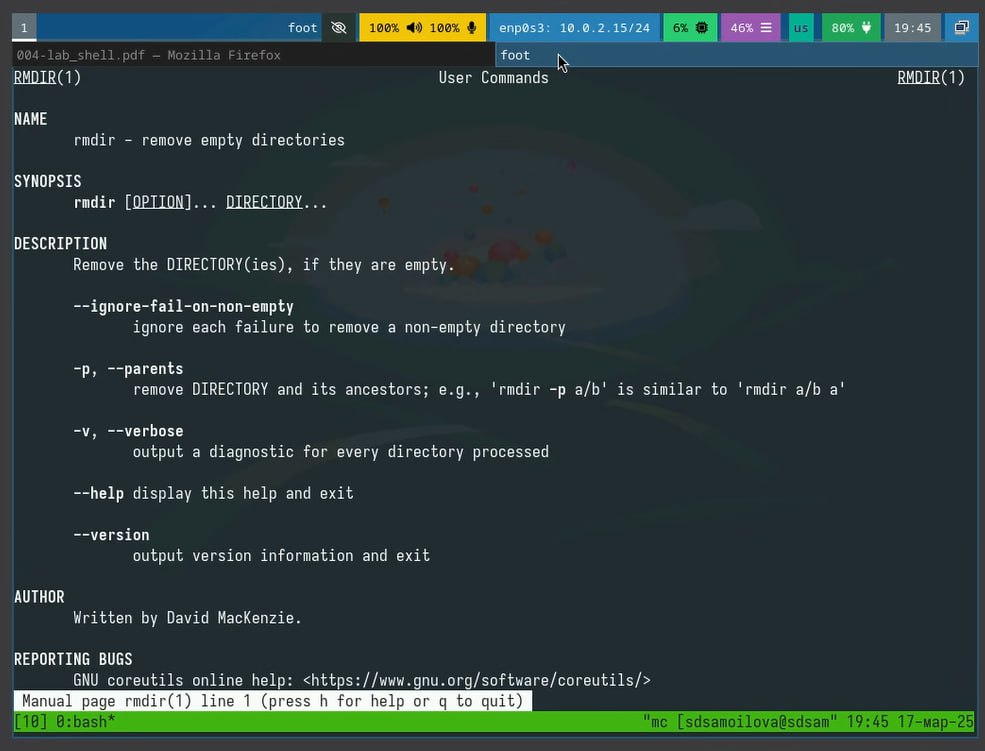

---
## Front matter
title: "Отчёт по лабораторной работе №6"
subtitle: "Дисциплина: Операционные системы"
author: "Самойлова Софья Дмитриевна"

## Generic otions
lang: ru-RU
toc-title: "Содержание"

## Bibliography
bibliography: bib/cite.bib
csl: pandoc/csl/gost-r-7-0-5-2008-numeric.csl

## Pdf output format
toc: true # Table of contents
toc-depth: 2
lof: true # List of figures
fontsize: 12pt
linestretch: 1.5
papersize: a4
documentclass: scrreprt
## I18n polyglossia
polyglossia-lang:
  name: russian
  options:
	- spelling=modern
	- babelshorthands=true
polyglossia-otherlangs:
  name: english
## I18n babel
babel-lang: russian
babel-otherlangs: english
## Fonts
mainfont: IBM Plex Serif
romanfont: IBM Plex Serif
sansfont: IBM Plex Sans
monofont: IBM Plex Mono
mathfont: STIX Two Math
mainfontoptions: Ligatures=Common,Ligatures=TeX,Scale=0.94
romanfontoptions: Ligatures=Common,Ligatures=TeX,Scale=0.94
sansfontoptions: Ligatures=Common,Ligatures=TeX,Scale=MatchLowercase,Scale=0.94
monofontoptions: Scale=MatchLowercase,Scale=0.94,FakeStretch=0.9
mathfontoptions:
## Biblatex
biblatex: true
biblio-style: "gost-numeric"
biblatexoptions:
  - parentracker=true
  - backend=biber
  - hyperref=auto
  - language=auto
  - autolang=other*
  - citestyle=gost-numeric
## Pandoc-crossref LaTeX customization
figureTitle: "Рис."
listingTitle: "Листинг"
lofTitle: "Список иллюстраций"
lolTitle: "Листинги"
## Misc options
indent: true
header-includes:
  - \usepackage{indentfirst}
  - \usepackage{float} # keep figures where there are in the text
  - \floatplacement{figure}{H} # keep figures where there are in the text
---

# Цель работы

Целью данной работы является приобретение практических навыков взаимодействия пользователя с системой посредством командной строки.

# Задание

Относительно домашнего каталога будут выполняться последующие упражнения:

1. Работа с каталогом `/tmp`:
   • Перейти в каталог `/tmp` и вывести его содержимое с помощью `ls`, используя различные опции. Объяснить разницу между ними.
   • Проверить существование подкаталога `cron` в `/var/spool`.
   • Перейти в домашний каталог и вывести его содержимое, определив владельца файлов.
2. Создание и удаление каталогов:
   • Создать каталог `newdir` в домашнем каталоге.
   • В каталоге `~/newdir` создать подкаталог `morefun`.
   • Создать три каталога (`letters, memos, misk`) одной командой и удалить их.
   • Попробовать удалить каталог `~/newdir` с помощью `rm` и проверить результат.
   • Удалить каталог `~/newdir/morefun` и проверить, был ли он удалён.
3. Изучение команд:
   • Использовать `man` для определения опции команды `ls`, позволяющей просмотреть содержимое подкаталогов.
   • Узнать опции `ls` для сортировки по времени изменения файлов.
   • Просмотреть описание команд: `cd, pwd, mkdir, rmdir, rm` с помощью `man`.
   • Используя `history`, модифицировать и выполнить несколько команд из буфера.

# Теоретическое введение

- В операционной системе типа Linux взаимодействие пользователя с системой обычно осуществляется с помощью командной строки посредством построчного ввода команд. При этом обычно используется командные интерпретаторы языка shell: /bin/sh; /bin/csh; /bin/ksh. 
- Командой в операционной системе называется записанный по специальным правилам текст (возможно с аргументами), представляющий собой указание на выполнение какой-либо функций (или действий) в операционной системе. Обычно первым словом идёт имя команды, остальной текст — аргументы или опции, конкретизирующие действие. Общий формат команд можно представить следующим образом: <имя_команды><разделитель><аргументы>

# Выполнение лабораторной работы

Перейдем в каталог /tmp. Выведем на экран содержимое каталога `/tmp`. Для этого используем команду `ls` с различными опциями. Для того, чтобы отобразить имена скрытых файлов, необходимо использовать команду `ls` с опцией `a`. Чтобы вывести на экран подробную информацию о файлах и каталогах, необходимо использовать опцию `l` (рис. @fig:001).

{#fig:001 width=70%}

Определим, есть ли в каталоге `/var/spool` подкаталог с именем `cron`. Он есть. (рис. @fig:002).

{#fig:002 width=70%}

Возвращаюсь в домашний каталог и вывожу его содержимое. Владельцем каталогов является - `sdsamoilova` (я)(рис. @fig:003). 

{#fig:003 width=70%}

В домашнем каталоге создаю новый каталог с именем `newdir` и внутри него создаю каталог `morefun` (рис. @fig:004).

{#fig:004 width=70%}

В домашнем каталоге создайю одной командой три новых каталога с именами
`letters, memos, misk`. Затем удаляю эти каталоги одной командой (рис. @fig:005).

{#fig:005 width=70%}

При попытке удалить ранее созданный каталог `newdir` появилась ошибка, так как каталог невозможно удалить `rm` командой. Удаляю каталог `~/newdir/morefun` из домашнего каталога (рис. @fig:006).

{#fig:006 width=70%}

С помощью команды `man` определяю какую опцию команды `ls` нужно использовать для просмотра содержимое не только указанного каталога, но и подкаталогов, входящих в него (рис. @fig:007).

{#fig:007 width=70%}

Для просмотра содержимого не только указанного каталога, но и всех его подкаталогов, нужно использовать опцию -R (рекурсивный вывод).

Чтобы отсортировать выводимый список содержимого каталога по времени последнего изменения с развёрнутым описанием файлов, вам понадобятся следующие опции:

• `-l` — длинный формат (развёрнутое описание)
• `-t` — сортировка по времени последнего изменения

(рис. @fig:008).

{#fig:008 width=70%}

Использую команду `man` для просмотра описания следующих команд: `cd, pwd, mkdir,
rmdir, rm` (рис. @fig:009)(рис. @fig:010)(рис. @fig:011)(рис. @fig:012)(рис. @fig:013).

{#fig:009 width=70%}

{#fig:010 width=70%}

{#fig:011 width=70%}

{#fig:012 width=70%}

{#fig:013 width=70%}

Теперь давайте кратко рассмотрим основные опции для указанных команд:

• `cd` (change directory):
  • .. — переход в родительский каталог.
  • - — переход в предыдущий каталог.

• `pwd` (print working directory):
  •Нет опций, просто выводит текущий рабочий каталог.

• `mkdir` (make directory):
  • -p — создание промежуточных каталогов, если они не существуют.
  • -v — выводит сообщение о создании каждого каталога.

• `rmdir` (remove directory):
  • -p — удаляет указанный каталог и все его пустые родительские каталоги.
  • Нет опций для удаления непустых каталогов, так как эта команда работает только с пустыми.

• `rm` (remove):
  • -r — рекурсивное удаление каталогов и их содержимого.
  • -f — принудительное удаление без подтверждения.
  • -i — интерактивный режим, запрашивает подтверждение перед удалением.

Используя информацию, полученную при помощи команды `history`, выполняю модификацию и исполнение команды из буфера команд (рис. @fig:014).

{#fig:014 width=70%}

# Контрольные вопросы

1. Что такое командная строка? Командная строка (или «консоль») – это текстовый интерфейс между человеком и компьютером, в котором инструкции компьютеру даются путём ввода с клавиатуры текстовых строк (команд). Интерфейс командной строки противопоставляется управлению программами на основе меню, а также различным реализациям графического интерфейса. Команды, введённые пользователем, интерпретируются и выполняются специальной программой — командной оболочкой (или «shell» по-английски).
2. При помощи какой команды можно определить абсолютный путь текущего каталога? Приведите пример. Для определения абсолютного пути к текущему каталогу используется команда pwd (print working directory). Пример (абсолютное имя текущего каталога пользователя dharma): (pwd результат: /afs/dk.sci.pfu.edu.ru/home/d/h/dharma)
3. При помощи какой команды и каких опций можно определить только тип файлов и их имена в текущем каталоге? Приведите примеры. При помощи команды ls -F. (ls -F install-tl-unx/ newdir/ work/ Видео/ Документы/ Загрузки/ Изображения/ Музыка/ Общедоступные/ 'Рабочий стол'/ Шаблоны/)
4. Каким образом отобразить информацию о скрытых файлах? Приведите примеры. С помощью команды ls -a. (ls -a . .bash_logout .cache .gnupg .local .pki .var .vboxclient-draganddrop.pid .wget-hsts Документы Музыка Шаблоны .. .bash_profile .config install-tl-unx .mozilla .ssh .vboxclient-clipboard.pid .vboxclient-seamless.pid work Загрузки Общедоступные .bash_history .bashrc .gitconfig .lesshst newdir .texlive2022 .vboxclient-display-svga-x11.pid .vscode Видео Изображения 'Рабочий стол')
5. При помощи каких команд можно удалить файл и каталог? Можно ли это сделать одной и той же командой? Приведите примеры. Команда rm используется для удаления файлов и/или каталогов. Чтобы удалить каталог, содержащий файлы, нужно использовать опцию r. Без указания этой опции команда не будет выполняться (rm -r abc). Если каталог пуст, то можно воспользоваться командой rmdir. Если удаляемый каталог содержит файлы, то команда не будет выполнена — нужно использовать rm - r имя_каталога.
6. Каким образом можно вывести информацию о последних выполненных пользователем командах? работы? С помощью команды history.
7. Как воспользоваться историей команд для их модифицированного выполнения? Приведите примеры. Можно модифицировать команду из выведенного на экран списка при помощи следующей конструкции: !<номер_команды>:s/<что_меняем>/<на_что_меняем> (!3:s/a/F ls -F)
8. Приведите примеры запуска нескольких команд в одной строке. Если требуется выполнить последовательно несколько команд, записанный в одной строке, то для этого используется символ точка с запятой. (cd; ls)
9. Дайте определение и приведите примера символов экранирования. Если в заданном контексте встречаются специальные символы (типа «.», «/», «*» и т.д.), надо перед ними поставить символ экранирования \ (обратный слэш).
10. Охарактеризуйте вывод информации на экран после выполнения команды ls с опцией l. Чтобы вывести на экран подробную информацию о файлах и каталогах, необходимо использовать опцию l. При этом о каждом файле и каталоге будет выведена следующая информация: – тип файла, – право доступа, – число ссылок, – владелец, – размер, – дата последней ревизии, – имя файла или каталога.
11. Что такое относительный путь к файлу? Приведите примеры использования относительного и абсолютного пути при выполнении какой-либо команды. Относительный путь — это ссылка, указывающая на другие страницы вашего сайта относительно веб-страницы, на которой эта ссылка уже находится. Пример относительно пути: ./docs/files/file.txt Пример абсолютного пути: cd /home/dmbelicheva/work/study
12. Как получить информацию об интересующей вас команде? С помощью команды hepl.
13. Какая клавиша или комбинация клавиш служит для автоматического дополнения вводимых команд? Клавиша Tab.

# Выводы

Мы приобрели практические навыки взаимодействия пользователя с системой посредством командной строки.

# Список литературы
 
https://esystem.rudn.ru/mod/page/view.php?id=1224377